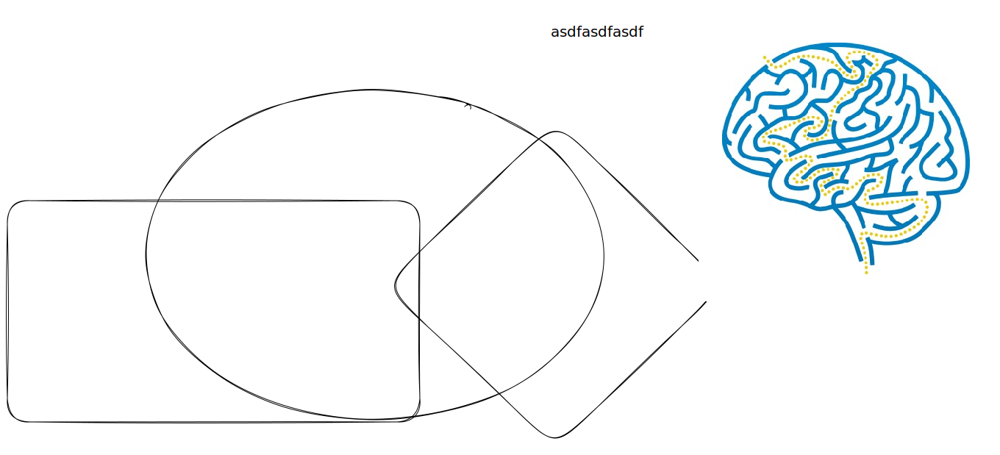

# multi code tab



```python

class Solution:
    def rob(self, nums):
        first = second = 0

        for val in nums:
            first, second = second, max(second, val + first)

        return second

```



```java

// c.java
// more better version

class Solution {
	public int rob(int[] nums) {
		int first = 0;
		int second = 0;
		int temp;

		for (int val : nums) {
			temp = first;
			first = second;
			second = Math.max(second, val + temp);
		}

		return second;
	}
}


```



asdfasdfasdf

as

df

asdf

a

sdf

a

sdf



<table data-view="cards"><thead><tr><th></th><th></th><th></th></tr></thead><tbody><tr><td></td><td></td><td></td></tr><tr><td></td><td></td><td></td></tr><tr><td></td><td></td><td></td></tr></tbody></table>

$$
f(x) = x * e^{2 pi i \xi x}
$$















```
// Some code
```

<figure><figcaption><p>asdfasdfasd</p></figcaption></figure>

<figure><figcaption></figcaption></figure>



<details>

<summary>asdfasdf</summary>


</details>

|   |   |   |
| - | - | - |
|   |   |   |
|   |   |   |
|   |   |   |


```java

// POV: as nums
// Math.max(nums[1], nums[2] + nums[0])

class Solution {
	public int rob(int[] nums) {
		if (nums.length == 1)
			return nums[0];

		nums[1] = Math.max(nums[0], nums[1]);

		for (int i = 2; i < nums.length; i++)
			nums[i] = Math.max(nums[i - 1], nums[i] + nums[i - 2]);

		return nums[nums.length - 1];
	}
}

```



testing


<details>

<summary></summary>


</details>

```cpp
// Some code

int a = 1;

int b = 2;


int c = a+b;tab
```
